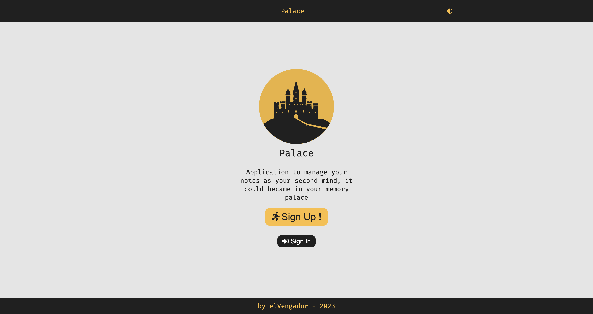

## Palace App



Introducing Version 2 of my note-taking app! After using Version 1 and noticing its limitations, I have made improvements:
- Now you can style your notes using markdown.
- Notes are presented in cards for a better look.
- Enjoy a dark theme for a comfortable experience.
- It's a Progressive Web App (PWA), meaning you can install it on both desktop and mobile.

I decided to use all my new knowledge and skills at that time to build a **complete project**:

- **Frontend:** Created with React, GraphQL, TypeScript, testing, and using atomic design principles. Styling is done with Sass, and it's also a Progressive Web App (PWA). 

- **Design:** Designed using Figma, I followed the design rules like contrast, spacing, grouping, consistency, etc.

- **Backend:** Built with Express, MongoDB, Redis, GraphQL, and includes an authentication module.

- **DevOps:** Implemented GitLab CI for continuous integration, Docker for containerization, and Nginx for serving. There's a reusable core for both frontend and backend.

- **Testing:** I had plans to use Jest for functions, the Testing Library for components, and Cypress for testing flows. However, due to the development of Version 3 of my note-taking app, I may not be able to implement these testing features.


Now, I'm moving to Vercel for hosting, so I'm no longer using my previous CI/CD setup with GitLab, Docker, and Nginx.

## Conceptual Design

Initially, I envisioned adding many features, and I called the whole thing 'mind nodes.' However, after thinking about it and embracing simplicity, I decided to keep it simple. The main idea for this app is like having a memory palace, that's why it's called 'Palace.'

- **Mind Palace (Initial Design):** You can explore my initial concept [Mind Palace Old Design Document](https://www.jimynicanor.com/palace-old.pdf).

- **Palace (Current Design):** After some reflection, here is the current design for 'Palace': [View Current Design Document](https://www.jimynicanor.com/palace-last.pdf).

- **Try Palace Now!:** Experience 'Palace' directly by following [this link](link_to_palace_app).

## How to run this application
```bash
# install dependencies
npm i

# get submodule files
git submodule init
git submodule update

# generate certification
cd certs 
mkcert localhost

# run with webpack on https://localhost:4000/
npm run dev
```

## Architecture
Clean Architecture with shareable frontend core, these are the layers:
- **Domain**: Definition of entities and use cases
- **Application**: Controllers, implementation of use cases
- **infrastructure**: Third technologies around the application (web, DBs, ...)
- **Presentation**: Views structure by atomic design


## License

This project is licensed under the MIT License - see the [LICENSE](LICENSE) file for more details.

## Contact
If you have questions, get in touch with Jimy at **dev.jimynicanor@gmail.com**.